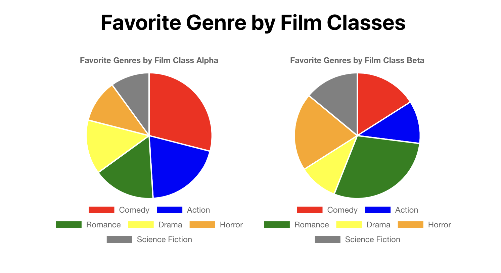

# Create react pie chart using chart.js


## Install packages

* [chart.js](https://www.npmjs.com/package/chart.js) 
* [react-chartjs-2](https://www.npmjs.com/package/react-chartjs-2)

```bash
npm install chart.js react-chartjs-2
```

## Creating React Charts

