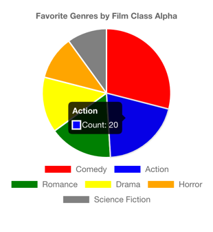
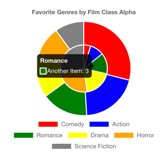

## Pie Chart

It's good to isolate the chart into a separate component, so you can have more control over changing it.

The first step, in line 6, is registering the chart elements and plugins. ArcElement is the element needed for building the pie chart.
*Title*, *Legend*, and *Tooltip* are the plugins added to the chart.

The `Pie` component has two main properties:*options* and *data*. The *options* are the Chart.js chart configuration. 
It's where you will set the properties of the plugins.

#### options

Lines 18-26 define the plugin properties. The title property in line 21 represents the chart `title`. 
Set the chart legend to the bottom in line 24.

#### data

The parameter data has two fields: *labels* and *datasets*.

The *labels* parameter receives an array of labels. Each label represents a slice of the pie chart.

The *dataset* parameter for the pie chart receives an array where each element represents a sub-pie. 
The regular pie chart only requires one single item in the array, like in our code in lines 31-35.

```javascript
[
    {
        label: "Count",
        data: props.genres.map(genre => genre.count),
        backgroundColor: props.genres.map(genre => genre.color)
    }
]
```

In this block we can see three main fields:

* *label*: is the label of the value of the slice.
* *data*: is the array of the values of all slices. The order should match the order of labels defined in line 29.
* *backgroundColor*: is the array of the colors of all slices. The colors could be hex or color names. e.g., *yellow*, *red*, *ffcc00*, *fee*, etc. The order also should match the order of labels defined in line 29.



If you want to add a sub-pie to the chart, you can add a second item to the dataset array, e.g.:

```javascript
[
    {
        label: "Count",
        data: props.genres.map(genre => genre.count),
        backgroundColor: props.genres.map(genre => genre.color)
    },
    {
        label: "Another Item",
        data: [1, 2, 3, 4, 5, 6],
        backgroundColor: colors
    }
]
```

In this example, we kept the same color for the inner pie but added different values for the `Another Item` label. 
This is not a real scenario, but we demonstrate what it looks like if you want to display extra data in your pie chart.



You can check all the supported properties in the [Pie Chart Docs](https://react-chartjs-2.js.org/components/pie).

### Hold on. Let's refactor it before moving on.

This code is simplified to make it easier to understand the data going to each one of the parameters. But for sure, it could be optimized for real usage. 
It could be better to perform iterations during rendering, so we should optimize lines 29, line 33, and line 34.