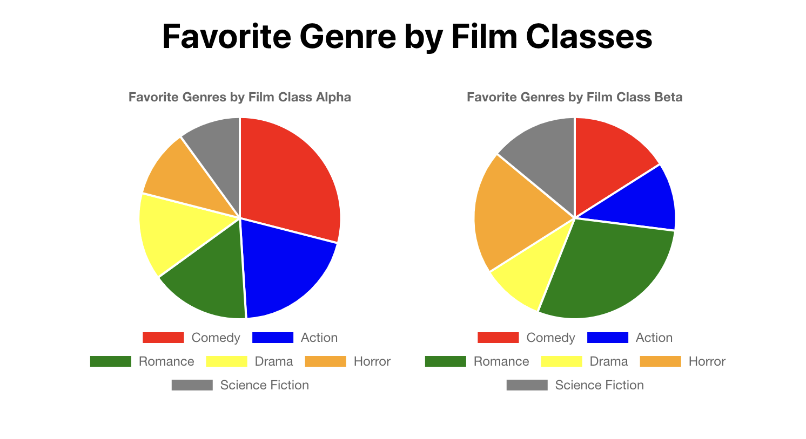

# Create react pie chart using chart.js

## *Problem:* how to create a pie chart in react?

This is a simple solution on how to implement a react pie chart using chart.js. 
The idea here is to give you the enough information to build your own pie chart using chart.js.
We are answering the basic questions, so you will be able to create the initial version of the chart, 
and in case you need something else, more specific, you can easier extend our example.

